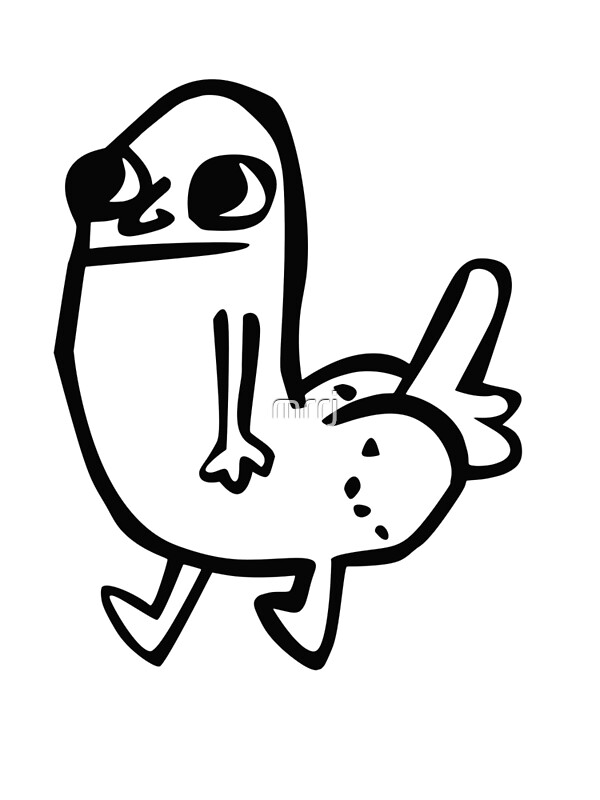
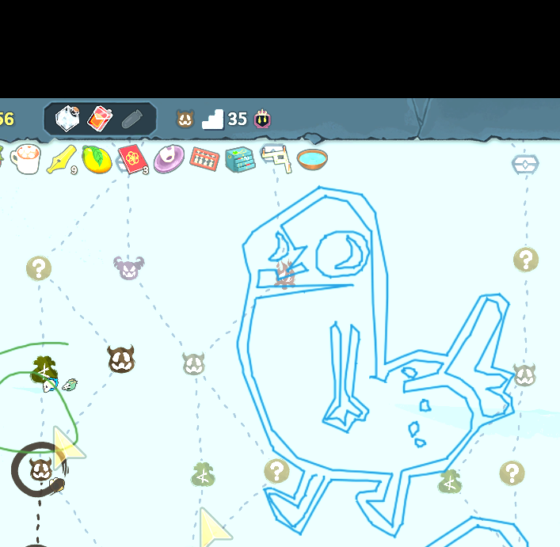

# Dickbutt Drawer

AutoHotkey v2 script that automatically draws the classic dickbutt meme using mouse movements. Paths are traced from the reference image using OpenCV contour detection.

### Example Output

## Usage

1. Install [AutoHotkey v2](https://www.autohotkey.com/)
2. Run `dickbutt_draw.ahk`
3. Position your mouse where you want the top-left of the drawing
4. Press the hotkey:
   - **F4** — Holds RMB per stroke, draws with LMB (for games/drawing apps that use RMB)
   - **F5** — Draws with LMB only (for Paint, whiteboards, etc.)
5. **Escape** to abort mid-draw

## Configuration

Edit the variables at the top of the script:

| Variable    | Default | Description                              |
|-------------|---------|------------------------------------------|
| `scale`     | `1.5`   | Size multiplier (1.0 = ~300x335px)       |
| `drawSpeed` | `2`     | Mouse move speed (0=instant, 100=slow)   |
| `ptDelay`   | `5`     | Milliseconds between waypoints           |
